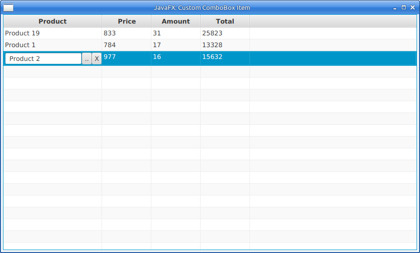

# JavaFXAddingButtonsInsideTableCell
JavaFX How To: Add buttons inside tableCell

It's very common task to add button inside cell for any action, usually for erasing and choosing new value.

It's how dialog looks like:

Button ".." opens choice dialog and button "X" erases cell value.
Hope it will be helpful.